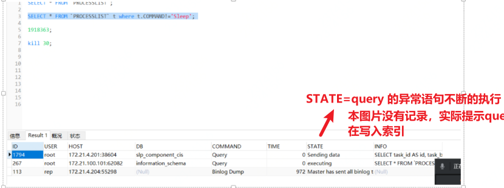

# mysql调优记录
[toc]


## 背景概述

    线上的生产环境发现work数据执行异常，但是本地调试正常，本地能正常生产，因为现上数据没有生成，所以怀疑是网络导致的数据库异常。

查看mysql状态 `systemctl status mysqld`发现启动正常

### 1，mysql语句

登录mysql服务器之后执行命令

```mysql
SELECT * FROM `PROCESSLIST` t where t.COMMAND!='Sleep';
```

发现如下 ` 图片没有记录，实际图片提示`

!(D:\02_学习文档\

执行命令 

```mysql
kill 30
```

再次查询发现异常仍然存在，粘贴上述语句INFO信息后查看

````mysql
select * from tmc_flow_task_d where 1=1 and status=4 order by prioity desc limit 10;
````


查看此处代码结合当前业务，此为高频sql，在status处增加索引后此异常提示消失。

## 2，mysql服务器

在mysql服务器执行 `top` 命令后看到在没有作业的情况下mysql的使用达到100%多，查看服务的数据库配置发现没有设置连接数及超时时间，所以更改mysql连接数的设置。

执行完以上两不步骤mysql重启服务器， 重启应用后正常。


## 3，域名反解析

在查看mysql日志时发现


是因为没有添加：skip-name-resolve 参数 `skip-name-resolve `,不再进行反解析（ip不反解成域名）


